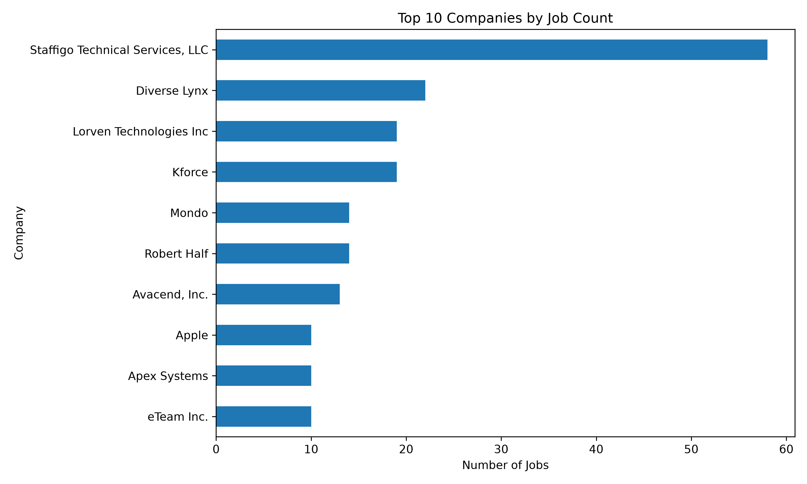

# Job Data ETL

## 项目简介

一个基于 Python 的招聘数据 ETL Pipeline 项目。

项目实现从原始 CSV 招聘数据读取、清洗、数据质量校验、统计分析、生成报告，并支持将处理后的数据加载到 PostgreSQL。

项目重点模拟真实 Data Engineer 工作流程：

- 数据抽取（Extract）
- 数据清洗转换（Transform）
- 数据质量检查（Data Quality Validation）
- 数据加载（Load）
- 自动化测试
- 可复现 Pipeline 执行

---

# 技术栈

- Python 3.11
- Pandas
- Typer（CLI）
- PostgreSQL
- Pytest
- YAML Configuration
- Git / GitHub

---

# 项目结构

```text
DE/
│
├── data/
│   ├── raw/
│   │   └── DataAnalyst.csv          # 原始招聘数据
│   │
│   └── clean/
│       └── jobs_clean.csv            # 清洗后数据
│
├── artifacts/
│   └── {timestamp}/                 # Top 分析报告输出
│
├── tests/
│   ├── test_clean.py                # 清洗函数测试
│   └── test_quality.py              # 数据质量测试
│
├── clean.py                         # 数据清洗模块
├── quality.py                       # 数据质量检查模块
├── pipeline.py                      # ETL Pipeline 主入口
├── load_to_postgres.py              # PostgreSQL 加载模块
├── clean_config.yaml                # 清洗规则配置
├── analysis.sql                     # SQL 分析脚本
├── report.md                        # Pipeline 报告
└── README.md
```

---

# 核心功能

## 1. 配置化数据清洗

通过 `clean_config.yaml` 管理清洗规则：

支持：

- 删除无用字段
- 无效值替换
- 公司名称清洗
- 薪资字段清洗
- 数据去重
- 缺失率统计

当前清洗规则：

- 删除 `Unnamed: 0`
- 替换无效值（例如 -1 → null）
- 清理 Company Name 换行内容
- 移除 Salary Estimate 中 `(Glassdoor est.)`
- 删除重复数据

---

# 2. Data Quality Check（数据质量检查）

Pipeline 集成自动化数据质量验证模块：

`quality.py`

包含三个检查：

## Row Count Check

检查清洗后的数据是否为空：

```python
check_row_count(df)
```

示例：

```
rows = 2253
passed = True
```

---

## Null Rate Check

监控关键字段缺失率：

检查字段：

- Job Title
- Company Name
- Location
- Industry

规则：

```
null rate > 20%
```

触发失败。

示例：

```
Company Name : 0.04%
Location     : 0%
Industry     : 0%
```

---

## Uniqueness Check

检查唯一字段重复情况：

当前使用：

```
job_id
```

示例：

```
duplicates = 0
passed = True
```

---

## Reliability Features

This ETL pipeline includes several production-oriented reliability features:

- Incremental loading to avoid reprocessing existing records.
- Idempotent database loading using PostgreSQL UPSERT.
- Automatic retry with exponential backoff for transient failures.
- Pipeline audit logging for each execution.
- Failure localization (`failed_step`) and error recording (`error_message`).
- Pipeline recovery by rerunning failed executions.

### Retry Strategy

The Load stage supports automatic retry.

- Maximum attempts: 4
- Exponential backoff
- Delay sequence: 2s → 4s → 8s

This improves pipeline reliability against temporary failures such as database connection issues.

# 3. 自动化测试

使用 Pytest 对核心函数进行测试：

运行：

```bash
pytest
```

测试内容：

- 清洗函数测试
- 行数检查测试
- 空值率检查测试
- 唯一性检查测试

当前结果：

```
5 passed
```

---

# 如何运行

## 1. 创建并激活虚拟环境

Windows PowerShell:

```powershell
cd D:\桌面\DE

.\de_env\Scripts\Activate.ps1
```

---

## 2. 运行测试

```bash
pytest
```

---

## 3. 运行 ETL Pipeline

仅执行清洗 + 数据质量检查 + 报告：

```bash
python pipeline.py --skip-load
```

完整流程：

```bash
python pipeline.py
```

流程包含：

```
读取 CSV
    ↓
数据清洗
    ↓
Data Quality Check
    ↓
保存 Clean CSV
    ↓
加载 PostgreSQL
    ↓
生成 Report
```

---

# 输出结果

## Clean Data

```
data/clean/jobs_clean.csv
```

清洗后数据：

```
2253 rows × 16 columns
```

包含：

- 原始字段
- job_id 唯一标识

---

## Pipeline Report

```
report.md
```

包含：

- 数据规模
- 公司数量
- Location 分布

---

## Quality Check Log

示例：

```
Quality check passed:

row_count
null_rate
uniqueness(job_id)
```

---

# 数据库加载

支持 PostgreSQL 数据加载：

模块：

```
load_to_postgres.py
```

数据库配置支持：

- .env 文件
- 环境变量

包含：

- 数据库连接
- 数据插入
- 公司与职位 UPSERT

### Day 20：表关系与去重规则

数据库保留三张表：

- `companies`：一行代表一家公司，`id` 是主键。
- `jobs`：一行代表一条职位记录，`id` 是主键，`company_id` 是必填外键，指向 `companies.id`。
- `pipeline_runs`：一行代表一次 Pipeline 运行。

公司与职位是一对多关系：一个公司可对应多条职位，每条职位必须属于一个公司。

公司名称使用 `lower(btrim(name))` 作为数据库层的唯一识别规则，因此
`Taskrabbit` 与 `TaskRabbit` 不能作为两家公司重复插入。加载器也使用该规则进行公司 UPSERT。

职位当前继续使用 `(company_id, title, location)` 作为业务去重键；该规则与增量过滤和职位 UPSERT 一致。

对已有数据库执行 Day 20 变更时，请运行：

```powershell
psql -d job_db -f sql/migrations/20260820_day20_company_identity.sql
```

---

# 项目流程

```
Raw CSV

   ↓

Load Data

   ↓

Clean Data
(column cleaning,
invalid value handling,
deduplication)

   ↓

Generate job_id

   ↓

Data Quality Validation

(row count,
null rate,
uniqueness)

   ↓

Save Clean CSV

   ↓

Load PostgreSQL

   ↓

Generate Report
```

---

Incremental Load

### Incremental Load

The pipeline performs incremental loading using a business key:

- Company Name
- Job Title
- Location

Existing records are queried from PostgreSQL first, and only unseen records are loaded into the database.

A helper script `make_incremental_test_data.py` is included for generating test data to verify incremental loading.
Business Key:

- Company Name
- Job Title
- Location

Pipeline workflow:

Extract
↓
Transform
↓
Incremental Filter
↓
Validate
↓
UPSERT
↓
Audit

ETL Pipeline

Architecture

CSV
↓
Extract
↓
Transform
↓
Validate
↓
Incremental / Backfill
↓
PostgreSQL
↓
Audit

然后下面写：

Features

✔ Config (.env)

✔ YAML

✔ Logging

✔ Validation

✔ Incremental Loading

✔ Historical Backfill

✔ UPSERT

✔ Audit

✔ Report

再加：

How to Run

python main.py

python main.py --backfill data/raw/DataAnalyst.csv

## Database Optimization

Indexes added:

- idx_jobs_company_id
- idx_jobs_title

Example:

EXPLAIN ANALYZE
SELECT \*
FROM jobs
WHERE company_id = 10;

Execution plan:

Index Scan using idx_jobs_company_id

## Data Visualization

The pipeline also generates visualization reports.

### Top 10 Companies by Job Count



# 验证结果

当前 Pipeline 运行结果：

```
Input:
2253 rows

Output:
2253 rows

Columns:
16 columns

Quality Checks:

✓ Row Count Check
✓ Null Rate Check
✓ job_id Uniqueness Check
```

测试结果：

```
5 passed
```

---

# 难点与优化

## 数据质量设计

真实 ETL 流程中，数据清洗后不能直接进入数据库，需要经过质量校验。

本项目加入：

- 行数检查
- 缺失率监控
- 唯一性检查

---

## 数据库去重与幂等

PostgreSQL 使用数据库约束和 UPSERT 保证幂等加载：

- 公司：`lower(btrim(name))` 的唯一索引防止大小写或首尾空格造成的重复公司。
- 职位：`(company_id, title, location)` 唯一约束防止当前项目定义下的重复职位。
- 加载器对公司和职位都执行 UPSERT；重复运行不会新增相同业务键的数据。

---

## 可扩展方向

未来计划：

- 增加 requirements.txt
- 增加 CI/CD 自动测试
- 增加更多数据质量指标
  - 数据范围检查
  - 异常值检测
  - 数据漂移检测
- 从 Job Description 自动抽取 Skills

---

# Git Commit History

主要开发阶段：

```
init:
ETL pipeline with configurable cleaning

docs:
add interview-ready README

feat:
add data quality checks and tests

feat:
integrate quality validation into pipeline
```
